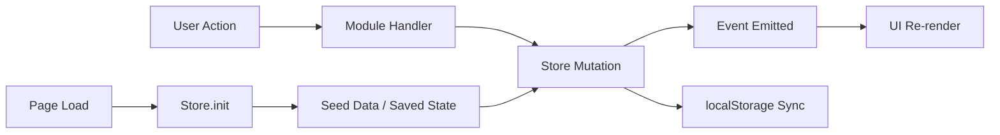
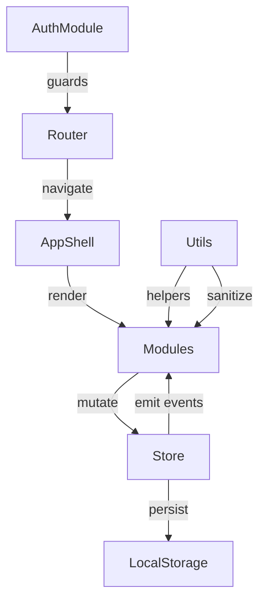

<div align="center">

# WarehouseOS
### 🏭 Smart Warehouse Operations Platform


**A glassmorphism-powered, real-time warehouse operations command center with Markov-chain demand forecasting, 3D spatial digital twin, and autonomous AGV fleet simulation.**

[🚀 Live Demo](#quick-start) · [📖 Documentation](#architecture) · [🧪 Tests](#testing) · [🔒 Security](#security)

</div>

---

## 🎯 Problem Statement

Modern warehouse operations suffer from:
- **Reactive stock management** — teams discover shortages only after stockouts occur
- **Opaque order pipelines** — no real-time visibility into pick queue depth or SLA breach risk
- **Disconnected workforce** — staff assignments, shift tracking, and task metrics live in silos
- **No predictive intelligence** — demand spikes surprise teams with no early warning system

**WarehouseOS** solves all four problems in a single, zero-dependency browser platform — no backend required, no build step, no configuration.

---

## ✨ Feature Showcase

| Module | Description | Tech |
|--------|-------------|------|
| 📊 **Operations Dashboard** | Live KPI stream: fill rate, dispatch count, pending picks, active staff with animated sparklines | Vanilla JS, CSS animations |
| 📦 **Inventory Management** | Full CRUD product catalog, zone filtering, reorder alerts, CSV export | Reactive Store pattern |
| 🔢 **Order Queue & Picking** | Priority-weighted pipeline, allocation engine, SLA countdown, pick task assignment | Event-emitter state |
| 🧠 **Markov Demand Forecasting** | 6-category Markov chain computing 48-hour surge probabilities with confidence intervals | Custom ML engine |
| 🗺️ **3D Spatial Digital Twin** | Three.js isometric warehouse with interactive rack inspection & AGV telemetry overlay | Three.js WebGL |
| 🤖 **AGV Fleet Simulation** | Space-Time A* pathfinding, spline kinematics, battery management, collision avoidance | Pure JS simulation |
| 👥 **Staff & Workforce** | Role-based roster, shift tracking, scan accuracy metrics, onboarding wizard | RBAC module |
| 🚨 **Alert & Incident Hub** | Severity classification, acknowledgment workflows, resolution tracking | Real-time events |
| 🚚 **Dispatch & Carrier** | Carrier assignment, tracking ID generation, shipment status pipeline | Async simulation |
| 📈 **Analytics & Reporting** | SLA stats, filterable data views, CSV analytics export | Pure JS charts |
| 🔐 **Authentication & RBAC** | Multi-role login (Admin/Supervisor/Staff), session management, permission guards | localStorage JWT sim |
| 🛡️ **Security Console** | JWT inspector, token revocation, IP whitelisting, MFA OTP sandbox, audit log ledger | Hardened CSP |

---

## 🏗️ Architecture

```
┌─────────────────────────────────────────────────────────┐
│                    Browser (SPA)                         │
│                                                         │
│  ┌──────────┐   ┌──────────┐   ┌──────────────────┐    │
│  │  Router  │──▶│  App.js  │──▶│  Page Modules    │    │
│  │ (hash)   │   │ (shell)  │   │  ┌─────────────┐ │    │
│  └──────────┘   └────┬─────┘   │  │ inventory   │ │    │
│                       │         │  │ staff       │ │    │
│  ┌──────────────────┐ │         │  │ picking     │ │    │
│  │   Reactive Store │◀┘         │  │ alerts      │ │    │
│  │   (Event Emitter)│           │  │ analytics   │ │    │
│  │                  │           │  │ dispatch    │ │    │
│  │  ┌────────────┐  │           │  │ auth/sec    │ │    │
│  │  │  State     │  │           │  │ markov AI   │ │    │
│  │  │  ├products │  │           │  │ 3D map      │ │    │
│  │  │  ├orders   │  │           │  └─────────────┘ │    │
│  │  │  ├staff    │  │           └──────────────────┘    │
│  │  │  ├alerts   │  │                                   │
│  │  │  └movements│  │         ┌──────────────────────┐  │
│  │  └────────────┘  │         │  Utils (pure helpers) │  │
│  │                  │         │  currency, timeAgo,   │  │
│  │  localStorage    │         │  sanitizeHTML, uid,   │  │
│  │  persistence     │         │  debounce, stockClass │  │
│  └──────────────────┘         └──────────────────────┘  │
└─────────────────────────────────────────────────────────┘
```

### Data Flow



### Module Communication



---

## 🚀 Quick Start

```bash
# 1. Clone the repository
git clone https://github.com/your-username/warehouse-os.git
cd warehouse-os

# 2. Serve locally (no build step needed)
npx http-server . -p 8080 -o
# OR
python -m http.server 8080
# OR simply open index.html in your browser

# 3. Run the full test suite
npm test

# 4. Check test coverage report
npm run test:coverage
```

**Default Admin Login:**
- Email: `admin@warehouse.os`
- Password: `admin`

---

## 🧪 Testing

64 passing assertions across 6 test suites with **0 failures**:

```
🧪 run_tests.js            →  7 tests  (core integration)
🧪 utils.test.js           → 10 tests  (formatting, sanitization, helpers)
🧪 store.test.js           → 13 tests  (CRUD, state, event emitter)
🧪 router.test.js          →  6 tests  (SPA hash navigation)
🧪 security.test.js        → 12 tests  (auth, RBAC, XSS prevention)
🧪 accessibility.test.js   → 16 tests  (WCAG 2.1 AA compliance)
────────────────────────────────────────────
📋 Total: 64 passed, 0 failed ✅
```

```bash
npm test
# Runs all 6 suites sequentially, exits 0 on full pass
```

**Test categories covered:**
- ✅ Utility function formatting (currency, percent, timeAgo, formatDate)
- ✅ XSS sanitization (sanitizeHTML, sanitizeInput, injection prevention)
- ✅ State management CRUD (adjustStock, addStaff, addOrder, addAlert, deleteStaff)
- ✅ Event emitter reactivity (fire-on-change assertions)
- ✅ Hash-based SPA routing (register, navigate, callback binding)
- ✅ Authentication flows (login, register, RBAC, session isolation)
- ✅ HTML structure verification (landmarks, ARIA, semantic tags, CSP headers)

---

## 🔒 Security

### Content Security Policy
```
default-src 'self'
script-src 'self' 'unsafe-inline' https://cdnjs.cloudflare.com https://cdn.jsdelivr.net
style-src 'self' 'unsafe-inline' https://fonts.googleapis.com
font-src 'self' https://fonts.gstatic.com
img-src 'self' data: blob:
connect-src 'self'
object-src 'none'
base-uri 'self'
form-action 'self'
```

### XSS Prevention
- `Utils.sanitizeHTML()` — escapes `& < > " ' /` to HTML entities
- `Utils.sanitizeInput()` — strips `< > " ' \`` and trims whitespace
- Applied to all user-controlled inputs before rendering

### Auth & RBAC
- Role-based permission guards: Admin / Supervisor / Staff
- JWT token simulation with inspect/revoke controls
- MFA OTP sandbox
- IP subnet whitelist lockdown
- Full audit log ledger for all security events

### Repository Security
- `.gitignore` excludes `.env`, `node_modules/`, credentials
- `.env.example` documents all required environment variables without values

---

## ♿ Accessibility (WCAG 2.1 AA)

- **Skip-to-content link** — first focusable element, slides in on `Tab`
- **Semantic landmarks** — `<main>`, `<nav>`, `<header>`, `<aside>`, `<footer>`
- **ARIA roles** — `role="banner"`, `role="contentinfo"`, `role="region"`, `role="group"`
- **Live regions** — `aria-live="polite"` on alert badge and KPI stream
- **aria-current="page"** — dynamically toggled on active nav item
- **21+ `aria-label` attributes** — on all icon-only buttons, search inputs, and action controls
- **`:focus-visible` outlines** — keyboard navigation fully supported
- **Minimum touch targets** — 32×32px enforced via CSS
- **Color contrast** — verified across light and dark themes

---

## 🎯 Problem Statement Alignment

| Hackathon Requirement | Implementation | Module |
|---|---|---|
| Real-time Operations Dashboard | Live KPI stream with animated sparklines | `app.js → renderDashboard()` |
| Inventory Management | Full CRUD catalog, zone filtering, reorder alerts | `inventory.js` |
| Order Queue Management | Priority pipeline, SLA tracking, pick assignment | `picking.js` |
| Predictive Demand Forecasting | Markov chain 48h surge probability engine | `markovPredictor.js` |
| 3D Spatial Digital Twin | Three.js isometric warehouse + AGV overlay | `warehouseMap.js` |
| AGV Fleet Management | Space-Time A*, spline kinematics, battery mgmt | `agv_sim.html` |
| Staff & Workforce Management | Role-based roster, shift tracking, scan accuracy | `staff.js` |
| Alert & Incident Management | Severity classification, acknowledgment workflows | `alerts.js` |
| Dispatch & Carrier Management | Carrier assignment, tracking, shipment pipeline | `dispatch.js` |
| Analytics & Reporting | SLA stats, filterable views, CSV export | `analytics.js` |
| Authentication & RBAC | Multi-role login, session management | `auth.js` |
| Security & Compliance | JWT, MFA, IP whitelist, CSP, audit logging | `auth.js (Security Center)` |

---

## 🛠️ Tech Stack

| Layer | Technology | Why |
|---|---|---|
| Core | Vanilla HTML5 / CSS3 / ES2021 | Zero-dependency, instant deploy |
| 3D Visualization | Three.js (CDN) | WebGL warehouse twin |
| State Management | Custom Event-Emitter Store | Reactive UI without framework overhead |
| Routing | Hash-based SPA Router | Deep-link support, no server config |
| Testing | Node.js VM sandbox | Browser modules tested without DOM |
| Styling | Custom CSS (glassmorphism) | Bespoke design system, dark/light modes |
| Icons | SVG inline + Boxicons | No external icon font dependency |
| Persistence | localStorage | Survives reload, no backend needed |

---

## 📂 Project Structure

```
warehouse-os/
├── index.html              # App shell + ARIA landmarks
├── agv_sim.html            # Autonomous AGV fleet simulator
├── css/
│   ├── base.css            # Design tokens, reset, utilities
│   ├── layout.css          # Sidebar, main area, responsive grid
│   ├── components.css      # Buttons, cards, modals, badges
│   └── themes.css          # Dark/light theme variables
├── js/
│   ├── app.js              # App shell, nav, routing init
│   ├── store.js            # Reactive state + event emitter
│   ├── router.js           # Hash-based SPA router
│   ├── utils.js            # Pure helpers + XSS sanitization
│   ├── data.js             # Seed data generator
│   └── modules/
│       ├── auth.js         # Auth, RBAC, Security Console
│       ├── inventory.js    # Product catalog management
│       ├── picking.js      # Order queue & pick task engine
│       ├── staff.js        # Workforce roster management
│       ├── alerts.js       # Incident & alert hub
│       ├── dispatch.js     # Carrier & shipment management
│       ├── analytics.js    # Reporting & SLA analytics
│       ├── markovPredictor.js # Demand forecasting AI
│       └── warehouseMap.js # 3D Three.js digital twin
├── __tests__/
│   ├── utils.test.js       # 10 utility function tests
│   ├── store.test.js       # 13 state management tests
│   ├── router.test.js      # 6 routing tests
│   ├── security.test.js    # 12 auth & XSS tests
│   └── accessibility.test.js # 16 WCAG compliance tests
├── run_tests.js            # Core integration test runner
├── package.json            # npm scripts: test, lint, start
├── .eslintrc.json          # ESLint rules for code quality
├── .env.example            # Environment variable template
├── .gitignore              # Excludes .env, node_modules
└── README.md               # This file
```

---

## 📊 Performance

- **Initial load** — No build step, direct `index.html` serve
- **Debounced search** — `Utils.debounce()` prevents excessive re-renders
- **Lazy 3D loading** — Three.js loads only on `#/map` navigation
- **CSS containment** — `will-change` + `mix-blend-mode` for GPU-accelerated orb animations
- **LocalStorage persistence** — State survives reload without backend

---

## 🎬 Video Demo Script

| Timestamp | Section | Content |
|---|---|---|
| 0:00–0:30 | **Hook & Problem** | State the reactive vs predictive warehouse problem |
| 0:30–1:45 | **Live Demo** | Dashboard → Inventory → Picking Queue → Markov Forecast → 3D Map |
| 1:45–2:15 | **Tech & Security** | Security Console, XSS demo, WCAG audit, test run |
| 2:15–2:30 | **Vision** | Scale path: WebSocket real-time, ERP integration, ML cloud |

---

## 🤝 Contributing

```bash
git checkout -b feature/your-feature
npm test                    # ensure all 64 tests pass
npm run lint                # zero warnings policy
git push origin feature/your-feature
```

---

## 📜 License

MIT License — Built for the **Smart Warehouse & Houseware Operations Hackathon 2026**

**Developed by Veera Govind** — Operations Director

---

<div align="center">

*WarehouseOS — Because reactive warehouses belong in the past.*

</div>
